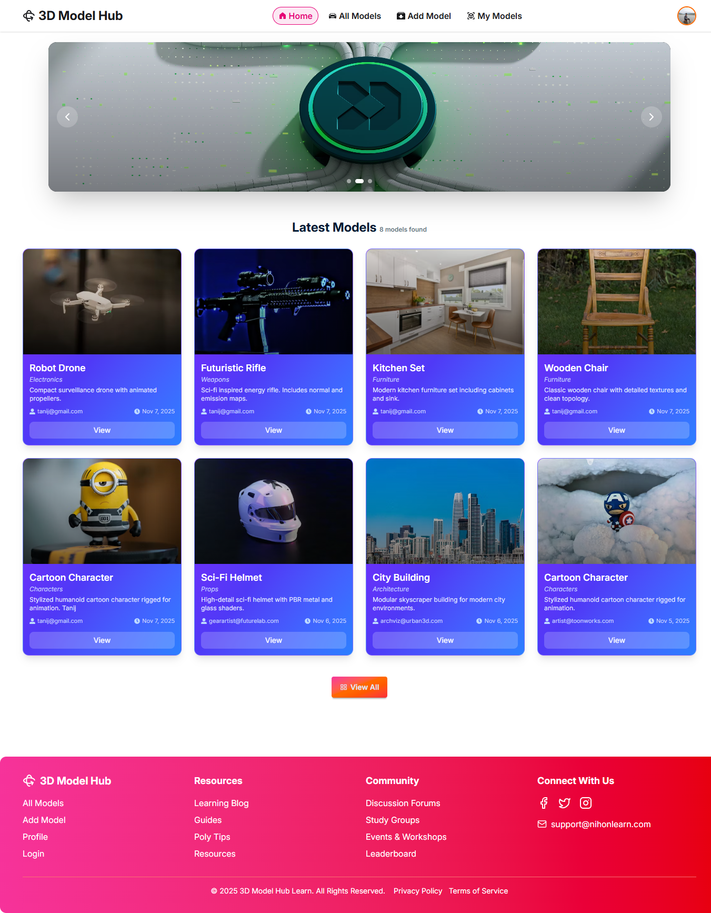

# 🛸 3D Model Hub – Explore & Download Stunning 3D Assets



## 🧩 Description

**3D Model Hub** is a responsive React application where users can explore, preview, and download a variety of high-quality 3D models.  
It supports dynamic browsing, search, model previews, downloads, ratings, and interactive notifications.

## 🚀 Live Demo

- **Frontend:** 🔗 [View Deployed App](https://model-hub-b12conceptual10.netlify.app)  
- **Backend:** 🔗 [View Backend API](https://3d-model-hub-server.vercel.app)

## 💡 Features

- Browse and filter 3D models across multiple categories like Vehicles, Furniture, Weapons, Characters, Architecture, Nature, and Props.
- View detailed model information, including description, creator, creation date, and download count.
- Download 3D models for personal or commercial projects.
- Interactive toast notifications with Hot Toast.
- Sweet Alert pop-ups for download confirmations and other actions.
- Firebase authentication and Firestore integration for user management.

## 🧰 Technologies Used

| Technology           | Purpose                        |
| -------------------- | ------------------------------ |
| **React.js**         | Frontend framework             |
| **React Router**     | Routing and navigation         |
| **Tailwind CSS**     | Styling                        |
| **DaisyUI**          | Pre-styled UI components       |
| **React Icons**      | Icons for UI elements          |
| **Hot Toast**        | Toast notifications            |
| **Sweet Alert**      | Pop-up alerts                  |
| **Axios**            | API requests                   |
| **Firebase**         | Authentication & Firestore     |
| **Spinners React**   | Loading indicators             |

## ⚙️ Installation & Local Setup
### Frontend Setup

1. Clone the frontend repository:
```js
git clone https://github.com/TanijRoy1/3d-model-hub-client.git
```

2. Navigate to the project folder:
```js
cd 3d-model-hub-client
```

3. Install dependencies:
```js
npm install
```

4. Create a `.env` file in the root and add Firebase config.

5. Start the development server:
```js
npm run dev
```

6. The app will run on http://localhost:5173

### Backend Setup

1. Clone the backend repository:
```js
git clone https://github.com/TanijRoy1/3d-model-hub-server.git
```

2. Navigate to the backend folder:
```js
cd 3d-model-hub-server
```

3. Install dependencies:
```js
npm install
```

4. Create a `.env` file in the backend root and add MongoDB credentials and Firebase service account keys.


5. Start the backend server:
```js
nodemon index.js
```

6. Backend API will run on http://localhost:3000

## 💻 Project Flow

- Frontend interacts with backend APIs using Axios.

- Firebase handles authentication and Firestore for storing user and model data.

- Users can browse, download, and rate 3D models seamlessly.

## 💡 Author

👤 **Tanij Roy**  
🔗 [GitHub Profile](https://github.com/TanijRoy1)

---
